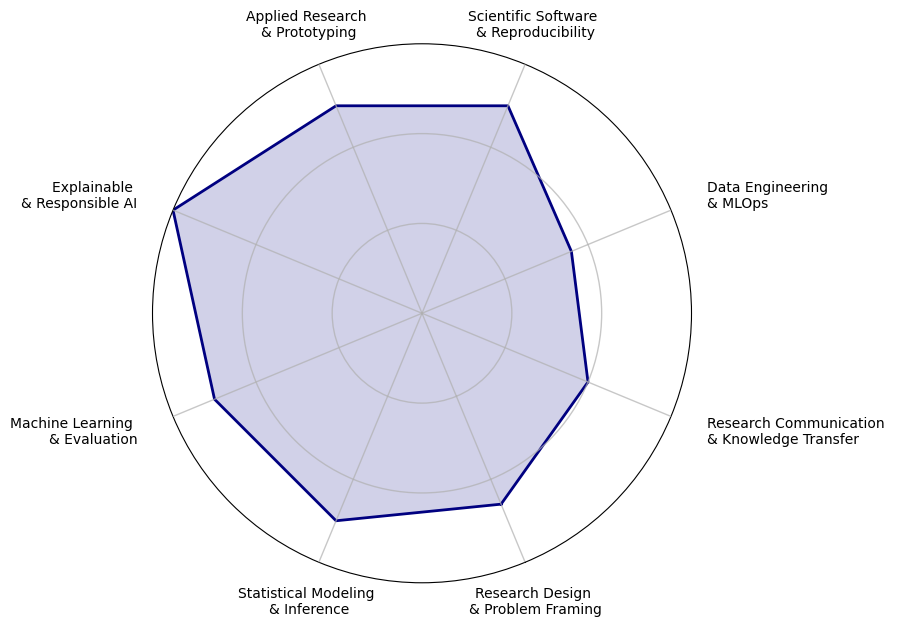

## Hi there 👋

I'm Klest Dedja, a Data Scientist with a background spanning **Applied Mathematics**, **Machine Learning**, and **Software Development**.

Coming from a background in mathematics, my carrer gradually moved me towards Computer Science and applied AI. My experience now covers **explainable AI**, **survival analysis**, **time-series forecasting**, **financial engineering**, **computer vision**, and end-to-end **software development**.

### 🏭 Industry experience:

I am currently a Data Scientist at CGI's [SmartLab](https://www.cgi.com/nl/nl/smartlab), where my role has expanded well beyond what we would have called "Data Science" a few years ago: depending on the project, I may find myself working on **system-prompt engineering**, building automated **evaluations for LLM alignment**, or upgrading the **front-end**.

Before that, I have worked at **[Predikt](https://predikt.ai/)**, a start-up dedicated (at the time) to advancing **time-series forecasting** for CFOs and finance leaders. Working in a dynamic environment gave me my first real exposure to a sizeable existing codebase, challenging me to understand, disentangle, and extend an existing codebase. I increased model accuracy through clever regularization tricks, and built estimated confidence bounds through **conformal predictions**.

### 🧑‍🔬💻 Research experience:

During my PhD at **KU Leuven**  under the supervision of Prof. [Celine Vens](https://kulak.kuleuven.be/~celine.vens/index.html) I specialized in **explainable AI** for survival analysis, where the predictive models and their explanations must account for partially observed time-to-event outcomes.

The main thread of my PhD was the combination of **random forests** and explainable AI, and this eventually grew into [BELLATREX](https://github.com/klestdedja/bellatrex). This is the project I am most proud of from my PhD years: something impactful and re-usable I left behind for the research group and to all interested researchers. BELLATREX is now an open-source Python package that is easy to use and has been downlaoded thousands of times, and I still enjoy working on it in my free time, following how people are picking it up and pushing it further.

Another significant part of my PhD involved **biomedical applications**, including Multiple Sclerosis and Acute Kidney Injury prediction. I could incorporate clinical context to enhance the accuracy of Machine Learning models. Just as importantly, I valued the (alas, occasional) close collaboration with neurologists, urologists, and intensive-care physicians, and acted as a bridge between my computer-science peers and the clinicians.

A smaller part of my PhD explored the intersection of **active learning** and **survival analysis**. There is certainyl still plenty of methodological room to explore, but I am less convinced about the practical demand for such a niche combination. The resulting experiments and approaches are available in this [repository](https://github.com/kLestdedja/AL-SA-paper-material).

More about these projects, and how they cross-influence each other, can be found in my dissertation [here](https://lirias.kuleuven.be/retrieve/dff3deaa-efd3-45e2-833c-e6db47d88434).

Finally, an unexpected side quest of my PhD involved automatically measuring fiber alignment in bio-artificial muscles, which gave me a hands-on familiarity to **computer vision** and image-processing techniques. The associated paper is under review, and another Python package is almost ready for release 😉. I see this project more as a successful technical excursion than something I plan to actively develop further.

  

### 🔭 Current Projects

- I am maintaining a project from my PhD years, namely **[BELLATREX](https://github.com/klestdedja/bellatrex)**: an open-access [package](https://pypi.org/project/bellatrex/) designed to support adoption and transparency of **Random Forest** models for several prediction tasks: binary classification, regression, survival-analysis, multi-lablel classification, and multi-target regression.

  Do you like BELLATREX? I am looking for collaborators to make it better! If you have fresh ideas, feature requests, or are interested in contributing to new functionalities, I’d love to connect 😊.
   Keep an eye on the repository and don't forget to add a ⭐️

- Another project involves extending **SHAP** explanatory toolbox to time-to-event data, with a focus on explaining feature importance across several time intervals through [IntervalSHAP](https://github.com/KlestDedja/intervalSHAP). This method unlocks insights that might otherwise go unnoticed, and is a fast and lean alternative to [SurvSHAP(t)](https://github.com/MI2DataLab/survshap).

- To be released to the public upon acceptance of the related paper: [EDGEHOG](https://github.com/klestdedja/directionality), a tool for automatic **directionality** estimate, using a **computer vision** approach

### 📫 How to reach me:

You can find me on LinkedIn: [Klest Dedja](https://www.linkedin.com/in/klest-dedja/).
